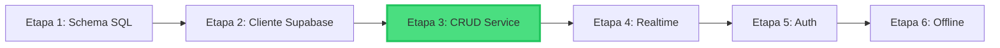
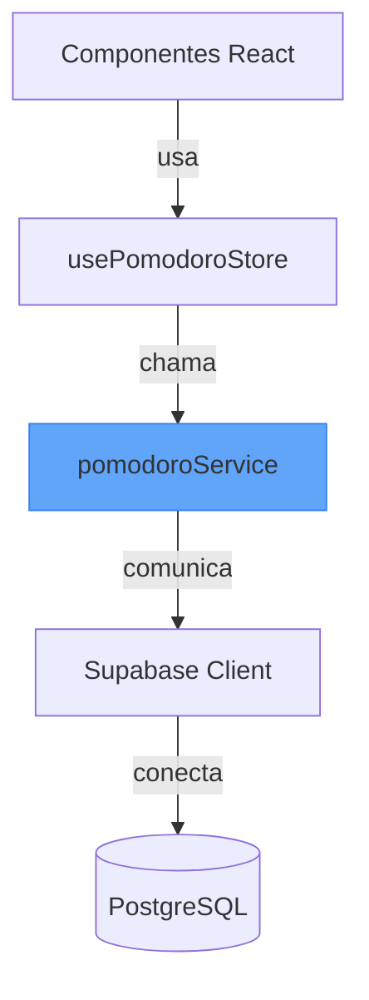
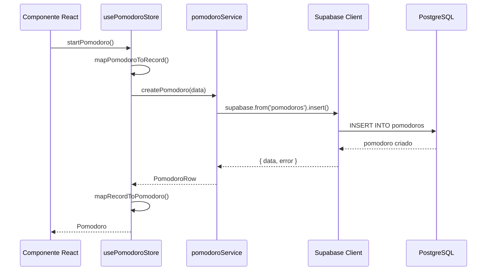
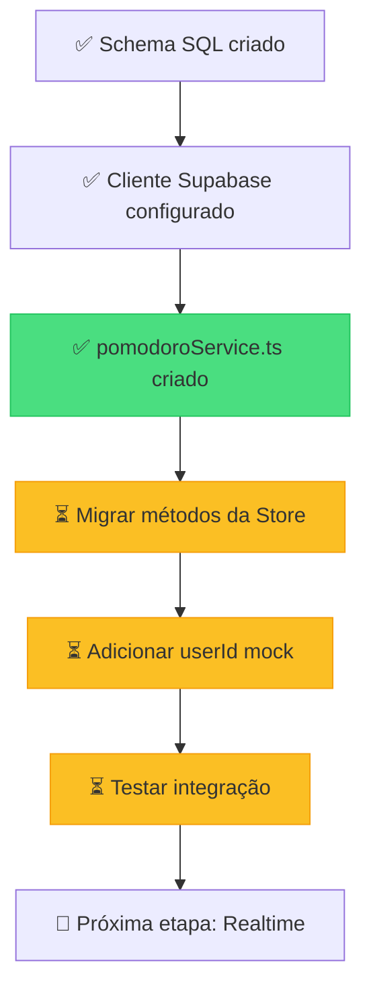

# Guia de Implementação: Migração CRUD Pomodoro para Supabase

**Data**: 17 de dezembro de 2024  
**Versão**: 1.0  
**Objetivo**: Migrar operações de persistência do Pomodoro de `localStorage` para Supabase

---

## 📋 Índice

1. [Visão Geral](#visão-geral)
2. [O que foi implementado](#o-que-foi-implementado)
3. [Arquitetura da Solução](#arquitetura-da-solução)
4. [Código Criado](#código-criado)
5. [Próximos Passos](#próximos-passos)
6. [Como Testar](#como-testar)
7. [Perguntas Frequentes](#perguntas-frequentes)

---

## Visão Geral

### Por que migrar para Supabase?

Atualmente, o sistema Pomodoro armazena dados localmente no `localStorage` do navegador. Isso tem limitações:

- ❌ Dados ficam presos em um único navegador/dispositivo
- ❌ Não há sincronização entre dispositivos
- ❌ Dados podem ser perdidos ao limpar o cache
- ❌ Não há backup automático

Com **Supabase**, ganhamos:

- ✅ Dados persistidos em nuvem (PostgreSQL)
- ✅ Sincronização em tempo real entre dispositivos
- ✅ Autenticação de usuários integrada
- ✅ Backup e segurança gerenciados
- ✅ Possibilidade de compartilhar dados entre usuários

### Etapas da Migração

Esta é a **Etapa 3** do plano completo de migração (ver `04-Migracao-Supabase-Pomodoro.md`):



Neste guia, cobrimos a **Etapa 3: criação da camada de serviço CRUD**.

---

## O que foi implementado

### 🆕 Arquivo Criado: `pomodoroService.ts`

**Caminho**: `src/lib/supabase/pomodoroService.ts`

Este arquivo centraliza **todas** as operações de banco de dados relacionadas a pomodoros:

| Função | O que faz |
|--------|-----------|
| `listPomodoros(userId)` | Busca todos os pomodoros de um usuário |
| `createPomodoro(data)` | Cria um novo pomodoro no banco |
| `updatePomodoro(id, updates)` | Atualiza um pomodoro existente |
| `deletePomodoro(id)` | Remove um pomodoro |
| `mapRecordToPomodoro(record)` | Converte dados do BD para o formato da aplicação |
| `mapPomodoroToRecord(pomodoro, userId)` | Converte dados da aplicação para o formato do BD |

### 🔄 Arquivo Modificado: `usePomodoroStore.ts`

**Caminho**: `src/state/usePomodoroStore.ts`

Adicionamos os imports necessários para integrar o serviço Supabase:

```typescript
import {
  createPomodoro as createPomodoroSupabase,
  updatePomodoro as updatePomodoroSupabase,
  mapPomodoroToRecord,
} from '../lib/supabase/pomodoroService';
```

> ⚠️ **Importante**: Ainda não migramos os métodos da store para usar essas funções. Isso será feito no próximo passo.

---

## Arquitetura da Solução

### Camadas da Aplicação



### Fluxo de Dados - Criar Pomodoro



### Separação de Responsabilidades

| Camada | Responsabilidade | Exemplo |
|--------|------------------|---------|
| **Componentes** | UI e interação do usuário | Botão "Iniciar Pomodoro" |
| **Store (Zustand)** | Estado global da aplicação | Gerenciar pomodoro ativo |
| **Service** | Lógica de negócio + API calls | Validar e salvar no BD |
| **Supabase Client** | Comunicação com servidor | HTTP requests |
| **PostgreSQL** | Persistência de dados | Armazenar registros |

---

## Código Criado

### 1. Tipos TypeScript

```typescript
// Tipos extraídos do schema do Supabase
type PomodoroRow = Database['public']['Tables']['pomodoros']['Row'];
type PomodoroInsert = Database['public']['Tables']['pomodoros']['Insert'];
type PomodoroUpdate = Database['public']['Tables']['pomodoros']['Update'];

// Estrutura do metadata JSONB
interface PomodoroMetadata {
  mode?: string;
  isValid?: boolean;
  invalidReason?: string;
  lostFocusSeconds?: number;
}
```

**Por que isso é importante?**
- `PomodoroRow`: Representa um registro **lido** do banco (tem todos os campos, incluindo `createdAt`)
- `PomodoroInsert`: Representa dados para **criar** um registro (sem `id`, `createdAt`, etc.)
- `PomodoroUpdate`: Representa dados para **atualizar** um registro (todos os campos opcionais)

### 2. Função: `createPomodoro`

```typescript
export async function createPomodoro(
  pomodoroData: PomodoroInsert
): Promise<{ data: PomodoroRow | null; error: PomodoroServiceError | null }> {
  try {
    const { data, error } = await supabase
      .from('pomodoros')
      .insert([pomodoroData] as any)
      .select()
      .single();

    if (error) {
      return {
        data: null,
        error: { message: 'Erro ao criar pomodoro', originalError: error },
      };
    }

    return { data, error: null };
  } catch (err) {
    return {
      data: null,
      error: { message: 'Erro inesperado ao criar pomodoro', originalError: err },
    };
  }
}
```

**Detalhes técnicos**:

1. **`.insert([pomodoroData])`**: Envia dados para o Supabase (note que é um array)
2. **`.select()`**: Retorna o registro criado (com `id`, `createdAt`, etc.)
3. **`.single()`**: Garante que retornamos apenas 1 registro
4. **`as any`**: Type assertion temporária (explicação abaixo)
5. **Tratamento de erros**: Retornamos sempre `{ data, error }` para facilitar uso

> 💡 **Por que `as any`?** O tipo `Database` ainda não conhece a tabela `pomodoros` porque não geramos os tipos a partir do schema real. Quando aplicarmos a migração SQL e regenerarmos os tipos, esse `as any` não será mais necessário.

### 3. Funções de Mapeamento

#### `mapPomodoroToRecord`: App → Supabase

```typescript
export function mapPomodoroToRecord(
  pomodoro: Pomodoro,
  userId: string
): PomodoroInsert {
  return {
    userId,
    title: undefined,
    durationMinutes: Math.floor(pomodoro.duration / 60), // Converte segundos → minutos
    startedAt: pomodoro.startedAt ?? new Date().toISOString(),
    endedAt: pomodoro.endedAt ?? undefined,
    isComplete: pomodoro.status === 'finished',
    metadata: {
      mode: pomodoro.mode,
      isValid: pomodoro.isValid,
      invalidReason: pomodoro.invalidReason,
      lostFocusSeconds: pomodoro.lostFocusSeconds,
    } as any,
  };
}
```

**O que acontece aqui?**
- Converte `duration` de **segundos** (usado na app) para **minutos** (armazenado no BD)
- Agrupa dados específicos da app em um campo JSONB `metadata`
- Adiciona `userId` para associar ao usuário autenticado

#### `mapRecordToPomodoro`: Supabase → App

```typescript
export function mapRecordToPomodoro(record: PomodoroRow): Pomodoro {
  const duration = (record.durationMinutes ?? 25) * 60;
  const startedAt = new Date(record.startedAt ?? new Date());
  const now = new Date();
  
  // Calcular tempo restante baseado no tempo decorrido
  const elapsedSeconds = Math.floor((now.getTime() - startedAt.getTime()) / 1000);
  const remaining = Math.max(0, duration - elapsedSeconds);

  const metadata = record.metadata as PomodoroMetadata | null;

  return {
    pomodoroId: record.pomodoroId,
    mode: (metadata?.mode as Pomodoro['mode']) || 'focus',
    status: record.isComplete ? 'finished' : 'running',
    duration,
    remaining,
    isValid: metadata?.isValid ?? true,
    lostFocusSeconds: metadata?.lostFocusSeconds ?? 0,
    startedAt: record.startedAt ?? undefined,
    endedAt: record.endedAt ?? undefined,
    invalidReason: metadata?.invalidReason,
  };
}
```

**Lógica importante**:
- Converte `durationMinutes` de **minutos** para **segundos**
- **Calcula `remaining`** dinamicamente (tempo restante desde que foi iniciado)
- Extrai campos do `metadata` JSONB
- Define valores padrão (`?? 25`, `|| 'focus'`)

---

## Próximos Passos

### 1. Aplicar a Migração SQL ao Supabase

Antes de testar, você precisa criar a tabela `pomodoros` no seu projeto Supabase:

**Opção A: Via painel Supabase**
1. Acesse [https://app.supabase.com](https://app.supabase.com)
2. Selecione seu projeto
3. Vá em **SQL Editor** (menu lateral)
4. Copie o conteúdo de `tcc-prototype-web/supabase/sql/pomodoro/create_pomodoros.sql`
5. Cole no editor e clique em **Run**

**Opção B: Via Supabase CLI**
```bash
# Dentro de tcc-prototype-web/
supabase db push --file supabase/sql/pomodoro/create_pomodoros.sql
```

### 2. Configurar Variáveis de Ambiente

Certifique-se de que o arquivo `.env` tem:

```env
VITE_SUPABASE_URL=https://seu-projeto.supabase.co
VITE_SUPABASE_ANON_KEY=sua-chave-aqui
```

> 💡 Encontre essas chaves no painel do Supabase em **Settings → API**

### 3. Migrar Métodos da Store

O próximo passo será modificar `usePomodoroStore.ts` para usar as funções do `pomodoroService`. Exemplo:

```typescript
// ANTES (localStorage)
startPomodoro: (opts = {}) => {
  const p: Pomodoro = { /* ... */ };
  set({ pomodoro: p });
  saveToStorage({ /* ... */ });
}

// DEPOIS (Supabase)
startPomodoro: async (opts = {}) => {
  const p: Pomodoro = { /* ... */ };
  set({ pomodoro: p });
  
  // Salvar no Supabase
  const userId = 'mock-user-id'; // Temporário até implementar Auth
  const record = mapPomodoroToRecord(p, userId);
  await createPomodoroSupabase(record);
  
  // Manter fallback localStorage
  saveToStorage({ /* ... */ });
}
```

### 4. Implementar userId Mock

Para testar sem autenticação, usaremos um ID fixo:

```typescript
const MOCK_USER_ID = 'test-user-123';
```

Quando implementarmos a Etapa 5 (Auth), substituiremos por:

```typescript
const userId = supabase.auth.getUser()?.id;
```

---

## Como Testar

### Teste 1: Verificar Compilação

```bash
cd tcc-prototype-web
npm run dev
```

✅ **Esperado**: Sem erros de TypeScript (apenas warnings de `as any`)

### Teste 2: Chamar Funções Manualmente

Abra o Console do Navegador e teste:

```javascript
// Importar funções (no console do navegador após build)
const { createPomodoro, listPomodoros } = await import('./src/lib/supabase/pomodoroService');

// Criar um pomodoro de teste
const testData = {
  userId: 'test-user-123',
  durationMinutes: 25,
  startedAt: new Date().toISOString(),
  isComplete: false,
  metadata: { mode: 'focus' }
};

const result = await createPomodoro(testData);
console.log('Criado:', result);

// Listar pomodoros
const list = await listPomodoros('test-user-123');
console.log('Lista:', list);
```

### Teste 3: Verificar no Supabase

1. Acesse o painel Supabase → **Table Editor**
2. Selecione a tabela `pomodoros`
3. Verifique se há registros criados

---

## Perguntas Frequentes

### 1. Por que usar `as any` nos type casts?

**R:** O arquivo `src/lib/supabase/types.ts` é um placeholder. Ele define a interface `Database`, mas a tabela `pomodoros` ainda não está mapeada corretamente porque os tipos não foram gerados a partir do schema real do Supabase.

**Solução futura**:
```bash
npx supabase gen types typescript --project-ref <SEU_PROJECT_ID> > src/lib/supabase/types.ts
```

Isso regerará os tipos baseando-se nas tabelas reais, eliminando a necessidade de `as any`.

### 2. Por que separar `pomodoroService.ts` da store?

**R:** Separação de responsabilidades (SOLID):

- **Store**: Gerencia **estado** da aplicação (o que está acontecendo agora)
- **Service**: Gerencia **persistência** (salvar/carregar dados)

Benefícios:
- ✅ Código mais testável
- ✅ Reutilizável (podemos usar o service em outros lugares)
- ✅ Mais fácil debugar
- ✅ Facilita trocar o backend no futuro (ex: Firebase → Supabase)

### 3. Por que armazenar `durationMinutes` em vez de `durationSeconds`?

**R:** Convenção de banco de dados. Durações são geralmente armazenadas em minutos pois:
- Economiza espaço (inteiro menor)
- Mais legível em queries SQL
- Padrão em muitos sistemas

A conversão acontece nos mappers, deixando a app usar segundos (mais preciso para timers).

### 4. O que acontece com os dados do `localStorage`?

**R:** Nada ainda! Mantemos o localStorage como **fallback**:

1. **Durante desenvolvimento**: App funciona offline
2. **Após migração completa**: Criaremos um script para importar dados antigos

### 5. Como funciona o RLS (Row Level Security)?

**R:** A política criada no SQL:

```sql
create policy "users_can_access_own_pomodoros"
  on pomodoros
  for all
  using (auth.uid() = userId);
```

Garante que:
- ✅ Usuário A só vê seus próprios pomodoros
- ❌ Usuário A **não consegue** ler/editar/deletar pomodoros do Usuário B
- ✅ Segurança gerenciada pelo banco (não precisa confiar no frontend)

### 6. Qual a diferença entre `PomodoroRow` e `Pomodoro`?

| Tipo | Origem | Uso | Campos extras |
|------|--------|-----|---------------|
| `PomodoroRow` | Supabase (BD) | Operações de banco | `createdAt`, `updatedAt` |
| `Pomodoro` | App (domain) | Lógica de negócio | `remaining`, `status` |

Os mappers fazem a conversão entre esses tipos.

---

## Decisões Técnicas

### 1. Funções Assíncronas (async/await)

Todas as operações de banco são **assíncronas** porque:
- Chamadas de rede levam tempo
- Não queremos travar a UI
- Permite melhor tratamento de erros

### 2. Retorno Padronizado `{ data, error }`

Seguimos o padrão do Supabase:

```typescript
const { data, error } = await createPomodoro(/* ... */);

if (error) {
  console.error('Falhou:', error.message);
  return;
}

console.log('Sucesso:', data);
```

Benefícios:
- Não lança exceções (mais previsível)
- Força verificação de erros
- API consistente

### 3. Campos JSONB para Metadata

Armazenamos `mode`, `isValid`, etc. em um campo `metadata` JSONB porque:
- ✅ Flexível (fácil adicionar novos campos)
- ✅ Evita muitas colunas na tabela
- ✅ PostgreSQL tem excelente suporte a JSONB (indexação, queries)

---

## Recursos Adicionais

- 📚 [Documentação Supabase - JavaScript Client](https://supabase.com/docs/reference/javascript/introduction)
- 📚 [Documentação Zustand](https://docs.pmnd.rs/zustand/getting-started/introduction)
- 🎥 [Vídeo: Supabase + React (YouTube)](https://www.youtube.com/watch?v=dU7GwCOgvNY)
- 🔐 [Documentação RLS (Row Level Security)](https://supabase.com/docs/guides/auth/row-level-security)

---

## Resumo Visual



---

**Próximo guia**: `06-Integracao-Store-Supabase.md` (migração dos métodos da store)

**Dúvidas?** Documente-as e discuta com seu orientador!
